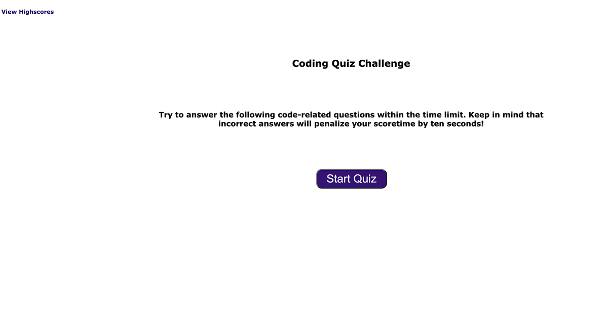

# Code Quiz
## by Aaron Rosenblatt
#### I created JS, CSS and HTML files from scratch to execute a quiz on coding. The quiz features a timer that counts down, a start button to begin the quiz and a series of questions where the answer is selected with the click of the button. As the questions continue the viewer can see if they answered "correct" or "wrong". If the viewer answers incorrectly, time is deducted from the quiz. After answering all the questions, the viewer can input their initials, view their score (based on the amount of time remaining), and see a list of the high scores. The scores and initials are stored in local-storage. When the scores are displayed, the user can restart the quiz or clear the list of high scores.   

### The GitHub repository for the Code Quiz can be viewed here: https://github.com/noplur/code-quiz2

### The link to the website of the Code Quiz can be viewed here: https://noplur.github.io/code-quiz2/

### Here is a screenshot of the Code Quiz:
### 